# Architecture

This document describes the system architecture of VPN Rotator with detailed diagrams.

## System Overview

VPN Rotator is a self-hosted system that automatically rotates WireGuard VPN nodes on Hetzner Cloud to enhance privacy and security. It provisions nodes on-demand, automatically destroys idle nodes to save costs, and handles seamless client migration during rotation.

### Key Components

1. **Rotator Service** - Core backend service managing node lifecycle and peer management
2. **Connector Client** - CLI tool for client devices
3. **Database** - SQLite for state persistence with peer and subnet management
4. **Hetzner Cloud** - Infrastructure provider for WireGuard nodes
5. **Peer Management System** - Comprehensive peer lifecycle management with IP allocation

## High-Level Architecture

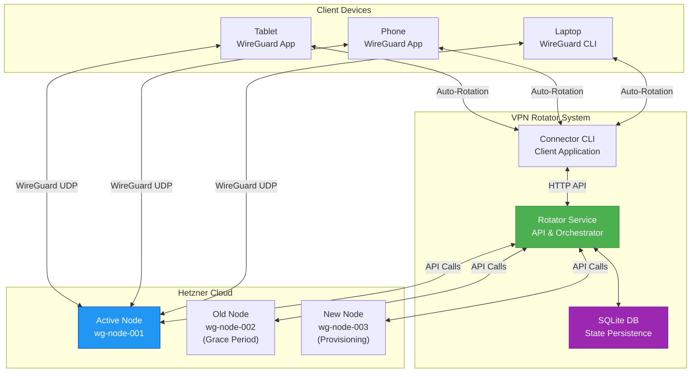

## Component Architecture

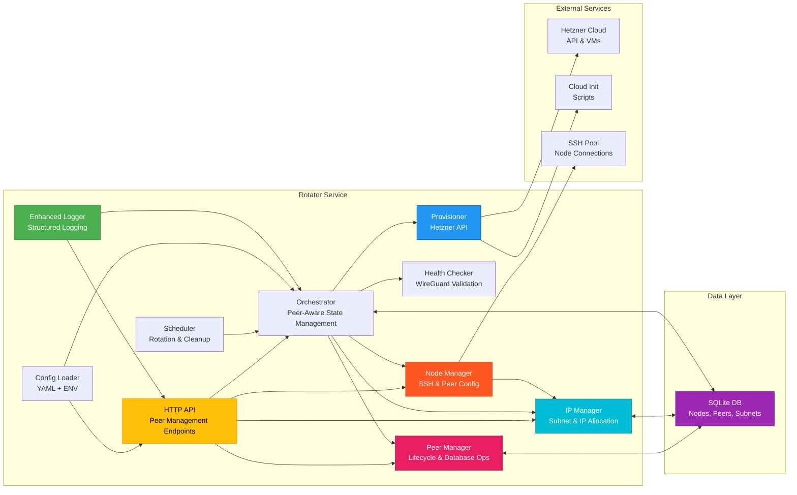

## Peer Management Architecture

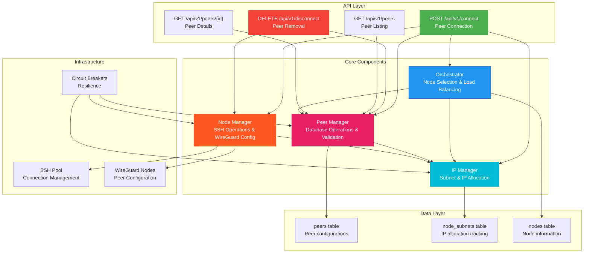

## Peer Connection Flow

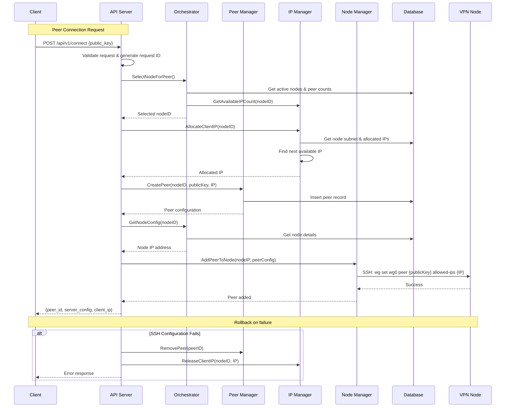

## IP Allocation Architecture

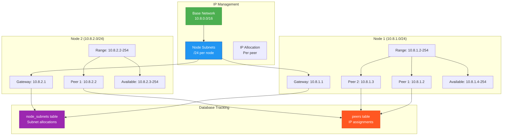

## Node Lifecycle Flow

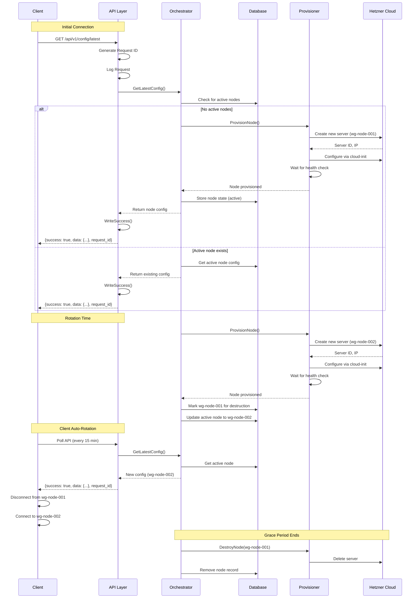

## Data Flow Architecture

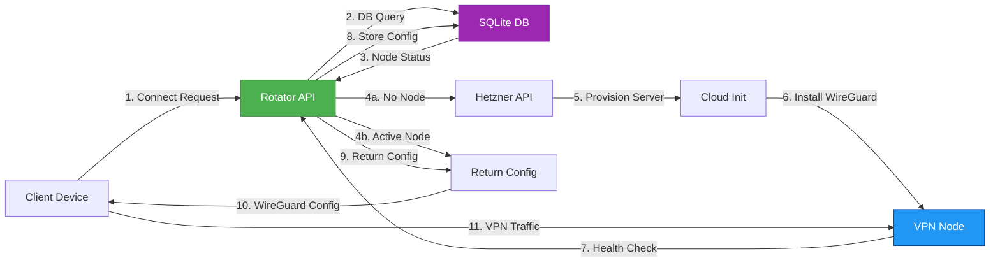

## Node Rotation Process

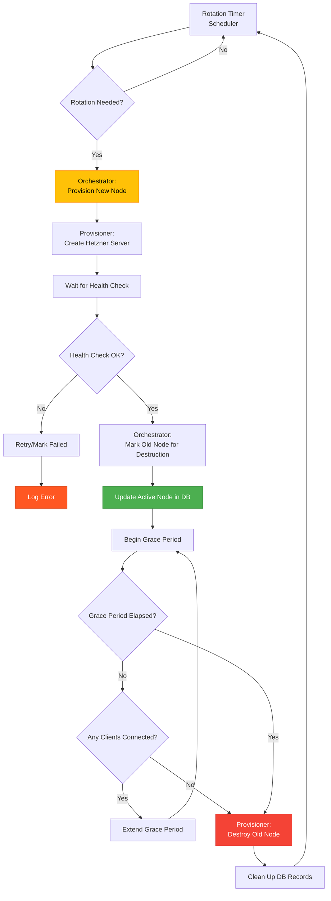

## Client Auto-Rotation Flow

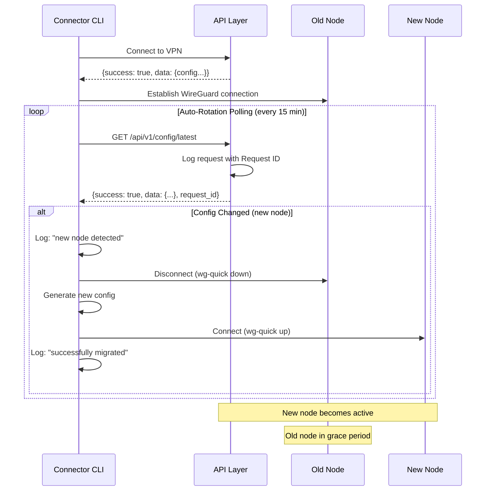

## Security Architecture

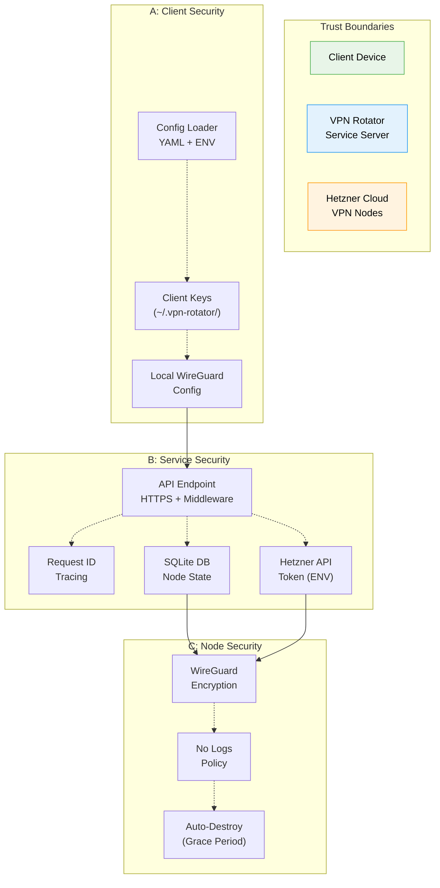

## API Request Flow

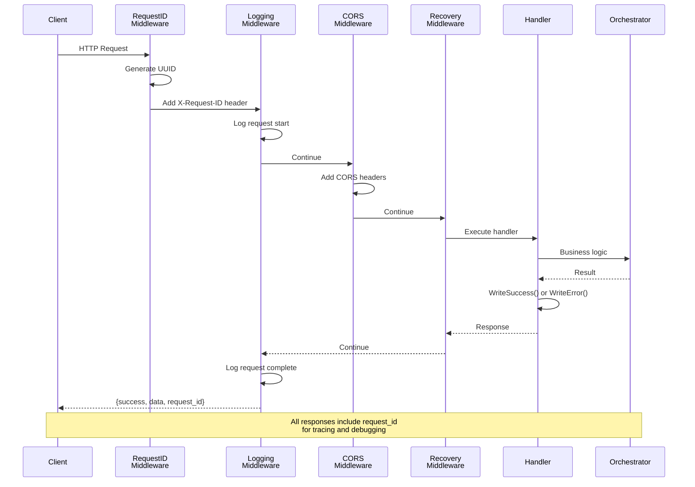

## Deployment Architecture

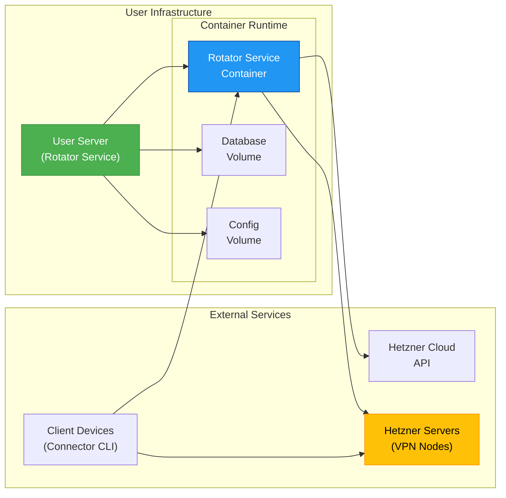

## Configuration Architecture

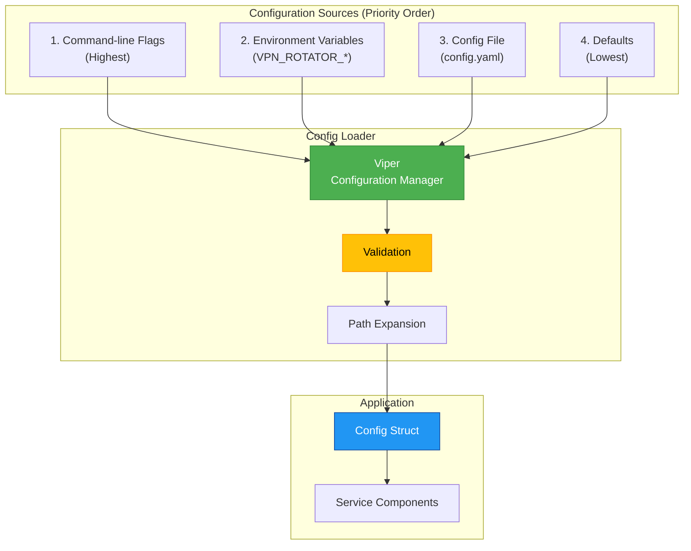

## Logging Architecture

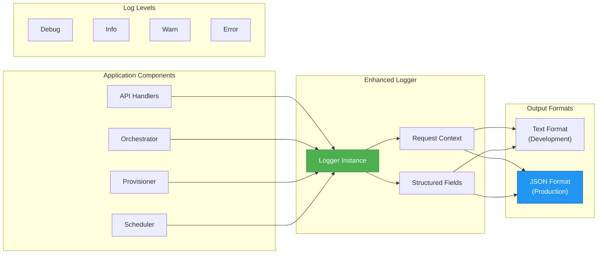

## Error Handling Flow

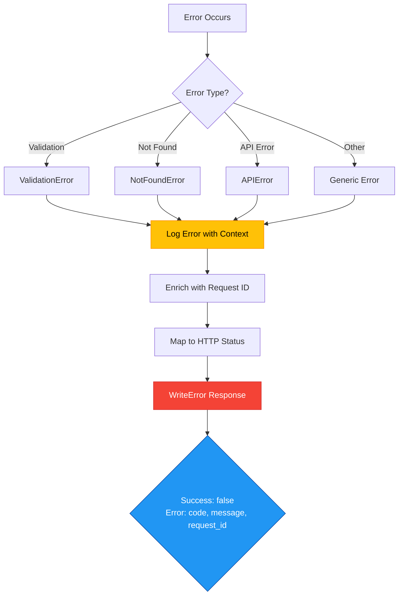