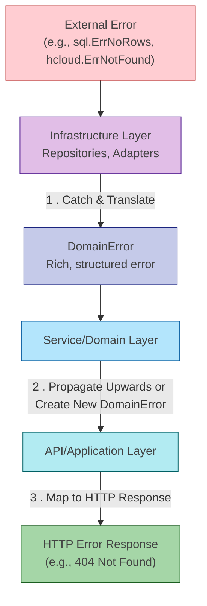

# Unified Error Handling & Developer Guide

This document is the single source of truth for error handling and logging in the VPN Rotator project. It provides a
comprehensive guide for developers on how to create, handle, and log errors in a consistent and structured manner.

## 1. Overview & Philosophy

Effective error handling is critical for building robust, maintainable, and observable systems. The previous approach in
this project involved a mix of `fmt.Errorf`, custom error types per package, and sentinel errors, leading to
inconsistency and making debugging difficult.

Our new philosophy is built on a **structured, domain-driven error handling system**.

**The Golden Rule:** Never use `fmt.Errorf` or the global `log/slog` package for errors that cross application layer
boundaries. Always use the structured `DomainError` types and the component-injected logger.

This approach provides:

- **Consistency**: All errors have a predictable structure.
- **Observability**: Errors produce rich, structured logs that are easy to query and alert on.
- **Clarity**: Errors are categorized by domain, with clear codes and retryability semantics.
- **Maintainability**: A centralized system makes it easy to manage and evolve error handling logic.

## 2. Core Architecture: The `DomainError`

The foundation of our error system is the `DomainError` interface, located in `internal/shared/errors/domain_errors.go`.
It ensures that every error carries a rich set of contextual information.

### The Interface

```go
// internal/shared/errors/domain_errors.go
type DomainError interface {
error
Domain() string // The domain where the error occurred (e.g., "node", "peer").
Code() string // A stable, machine-readable error code.
Retryable() bool // A flag indicating if the operation can be safely retried.
Metadata() map[string]any // A map of key-value pairs for additional context.
Timestamp() time.Time // The time the error occurred.
Unwrap() error        // Supports standard error unwrapping.
}
```

### Error Domains

To provide clear boundaries, errors are organized by domains:

- `DomainNode`: Node lifecycle, state, and capacity.
- `DomainPeer`: Peer connections, IP conflicts, validation.
- `DomainProvisioning`: Cloud provider operations, SSH, and health checks.
- `DomainInfrastructure`: Lower-level external services (e.g., circuit breakers).
- `DomainDatabase`: Data persistence, queries, and transactions.
- `DomainSystem`: Generic application issues like configuration and validation.

## 3. Error Handling by Layer

Errors should be handled differently depending on the architectural layer where they occur. The primary goal is to *
*translate** low-level, third-party errors into our structured `DomainError` at the boundary of the infrastructure
layer.



1. **Infrastructure Layer (e.g., `NodeRepository`)**: This is the **only** layer that should see raw third-party
   errors (like `sql.ErrNoRows`). Its job is to catch these errors and **translate** them into a specific `DomainError`,
   adding relevant context.
2. **Service/Domain Layer (e.g., `NodeService`)**: This layer should **never** receive raw errors. It operates
   exclusively with `DomainError` types. It either propagates errors from the repository upwards or creates new
   `DomainError`s to enforce business logic (e.g., a validation failure or business rule conflict).
3. **API/Application Layer (e.g., `NodeHandler`)**: This layer receives `DomainError`s from the service layer. Its job
   is to **map** these structured errors into appropriate HTTP status codes and a standardized JSON error response for
   the client. It should never create its own errors, except for request-level validation (e.g., missing path
   parameter).

## 4. Developer's Guide

This section provides practical, "how-to" guidance for working with the error system.

### 4.1. Creating & Wrapping Errors

#### Creating New Domain-Specific Errors

Use the domain-specific constructors to create new errors, especially in the service layer for business logic
validation.

```go
// Example: In a service, enforcing a business rule.
if !node.CanAcceptPeers() {
// CREATE a new, specific DomainError
err := apperrors.NewNodeError(
apperrors.ErrCodeNodeNotReady,
"node not ready to accept peers",
true, // Retryable, as it might be ready soon.
nil,  // No underlying error cause.
).WithMetadata("status", node.Status) // Add rich context.

s.logger.ErrorCtx(ctx, "node not ready", err)
return err
}
```

#### Translating External Errors

In the infrastructure layer, use wrapper functions to translate external errors into `DomainError`s.

```go
// Example: In a repository, handling a database error.
dbNode, err := r.store.GetNode(ctx, nodeID)
if err != nil {
var domainErr apperrors.DomainError
if err == sql.ErrNoRows {
// 1. TRANSLATE the database error to a domain-specific one.
domainErr = apperrors.NewNodeError(
apperrors.ErrCodeNodeNotFound,
fmt.Sprintf("node %s not found", nodeID),
false, // Not retryable.
err,   // Keep the original error as the cause.
)
// 2. Log appropriately (Not Found is often a warning).
r.logger.WarnContext(ctx, "node not found", slog.String("node_id", nodeID))
} else {
// 1. TRANSLATE a general DB error.
domainErr = apperrors.NewDatabaseError(
apperrors.ErrCodeDatabase,
"failed to get node",
true, // DB connection issues are often retryable.
err,
)
// 2. Log the rich error.
r.logger.ErrorCtx(ctx, "database get failed", domainErr)
}
return nil, domainErr // 3. Return our structured DomainError.
}
```

### 4.2. Logging Errors Effectively

**Never use `logger.Error(err.Error())`**. This loses all the structured context.

**Always use `logger.ErrorCtx(ctx, "message", err, ...)`**.

The `ErrorCtx` method is specifically designed to work with our `DomainError` interface. It automatically unpacks the
error and logs its structured fields: `Domain`, `Code`, `Retryable`, and `Metadata`.

**Do This:**

```go
if err != nil {
// ErrorCtx automatically handles the rich DomainError fields.
s.logger.ErrorCtx(ctx, "failed to get node", err,
slog.String("node_id", nodeID)) // Add *extra* contextual information.
return err
}
```

**Generated JSON Log:**

```json
{
  "level": "ERROR",
  "time": "2024-01-15T10:30:00.123Z",
  "msg": "failed to get node",
  "request_id": "req-xyz-123",
  "component": "node.service",
  "node_id": "node-abc",
  "error_domain": "database",
  "error_code": "database_error",
  "retryable": true,
  "error_metadata": {
    "query": "GetNode"
  },
  "error": "[database:database_error] failed to get node: connection refused"
}
```

**Not This (❌ BAD):**

```go
if err != nil {
// This logs the error as a flat string, losing all structure.
s.logger.ErrorContext(ctx, "failed to get node", "error", err.Error())
return err
}
```

### 4.3. Checking for Specific Errors

Because our errors contain wrapped causes and metadata, directly comparing error instances with
`errors.Is(err, apperrors.DomainErrNodeNotFound)` will often fail.

**Always check for errors using the error code.**

**Do This:**

```go
// In an application service...
node, err := s.nodeService.GetNode(ctx, nodeID)
if err != nil {
// Check the error code, not the error instance.
if apperrors.IsErrorCode(err, apperrors.ErrCodeNodeNotFound) {
// This is a "Not Found" error, which might not be a failure.
// Maybe we need to create the node instead.
s.logger.WarnContext(ctx, "node not found", slog.String("node_id", nodeID))
} else {
// This is a different, unexpected server error. Propagate it.
s.logger.ErrorCtx(ctx, "failed to get node", err)
return err
}
}
```

## 5. Comprehensive Error Code Reference

| Domain             | Code                   | Description                                                             | Retryable |
|--------------------|------------------------|-------------------------------------------------------------------------|:---------:|
| **Node**           | `node_not_found`       | Node doesn't exist.                                                     |    No     |
|                    | `node_not_ready`       | Node is not in a state to accept operations (e.g., still provisioning). |    Yes    |
|                    | `node_at_capacity`     | Node has reached its maximum peer capacity.                             |    Yes    |
|                    | `node_unhealthy`       | Node failed a health check.                                             |    Yes    |
|                    | `node_conflict`        | The operation conflicts with the current node state.                    |    Yes    |
|                    | `node_validation`      | Invalid input for a node operation.                                     |    No     |
| **Peer**           | `peer_not_found`       | Peer doesn't exist.                                                     |    No     |
|                    | `peer_already_exists`  | A peer with the same public key already exists.                         |    No     |
|                    | `peer_ip_conflict`     | The requested IP is already allocated to another peer.                  |    No     |
|                    | `peer_validation`      | Invalid input for a peer operation.                                     |    No     |
| **Provisioning**   | `provision_failed`     | General failure during cloud server provisioning.                       |    Yes    |
|                    | `provision_timeout`    | Provisioning operation exceeded its time limit.                         |    Yes    |
|                    | `destruction_failed`   | Failure during cloud server destruction.                                |    Yes    |
|                    | `health_check_failed`  | A newly provisioned server failed its health checks.                    |    Yes    |
| **Infrastructure** | `ssh_command`          | An SSH command failed to execute on a node.                             |    Yes    |
|                    | `ssh_connection`       | Could not establish an SSH connection to a node.                        |    Yes    |
|                    | `circuit_breaker_open` | The circuit breaker is open, preventing the operation.                  |    Yes    |
|                    | `rate_limit_exceeded`  | An external API (e.g., Hetzner) rate limit was hit.                     |    Yes    |
|                    | `file_operation`       | An error occurred during a file upload/download.                        |    Yes    |
| **Database**       | `database_error`       | A general database error occurred.                                      |    Yes    |
| **System**         | `validation`           | General invalid input or request format.                                |    No     |
|                    | `configuration`        | A service configuration error was detected.                             |    No     |
|                    | `internal_error`       | An unexpected internal error.                                           |    No     |
|                    | `not_implemented`      | The requested feature is not implemented.                               |    No     |

## 6. API Error Responses

The API layer is responsible for translating `DomainError`s into a standardized JSON response for the client.
`WriteErrorResponse` in the API handlers centralizes this logic.

**Standard Error Response Format:**

```json
{
  "success": false,
  "error": {
    "code": "resource_not_found",
    "message": "The requested resource was not found."
  },
  "request_id": "req-xyz-123"
}
```

The `handleError` function inspects the `DomainError` code and maps it to the appropriate HTTP status code.

**Example Mapping:**

- `ErrCodeNodeNotFound` → `404 Not Found`
- `ErrCodeNodeAtCapacity` → `503 Service Unavailable`
- `ErrCodeNodeValidation` → `400 Bad Request`
- `ErrCodePeerConflict` → `409 Conflict`
- `ErrCodeDatabase` (if retryable) → `503 Service Unavailable`
- `ErrCodeInternal` → `500 Internal Server Error`

## 7. Best Practices Summary

- ✅ **Translate Early**: Convert external errors to `DomainError`s at the infrastructure boundary.
- ✅ **Propagate `DomainError`s**: Once an error is a `DomainError`, pass it up through the layers. Don't re-wrap it.
- ✅ **Log Errors Once**: Log the error with full context at the point where it is handled or translated. Don't log the
  same error at every level of the call stack.
- ✅ **Add Rich Context**: Use `.WithMetadata()` to add relevant details (IDs, states, values) to your errors.
- ✅ **Distinguish "Not Found"**: A "not found" error is often not a system failure. Handle it gracefully, often by
  logging at the `WARN` level.
- ✅ **Use ErrorCtx**: Always use `logger.ErrorCtx(ctx, "message", err, ...)` instead of
  `logger.LogError(ctx, err, "message", ...)`
- ❌ **Don't Ignore Errors**: Every error must be handled or returned.
- ❌ **Don't Use String Matching**: Never use `strings.Contains(err.Error(), "...")` to check for an error type. Use
  `apperrors.IsErrorCode()`.
