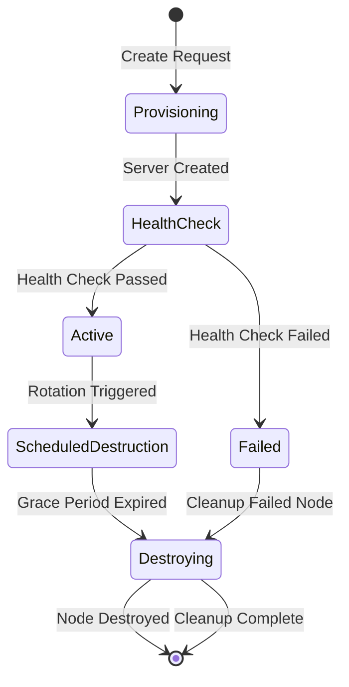
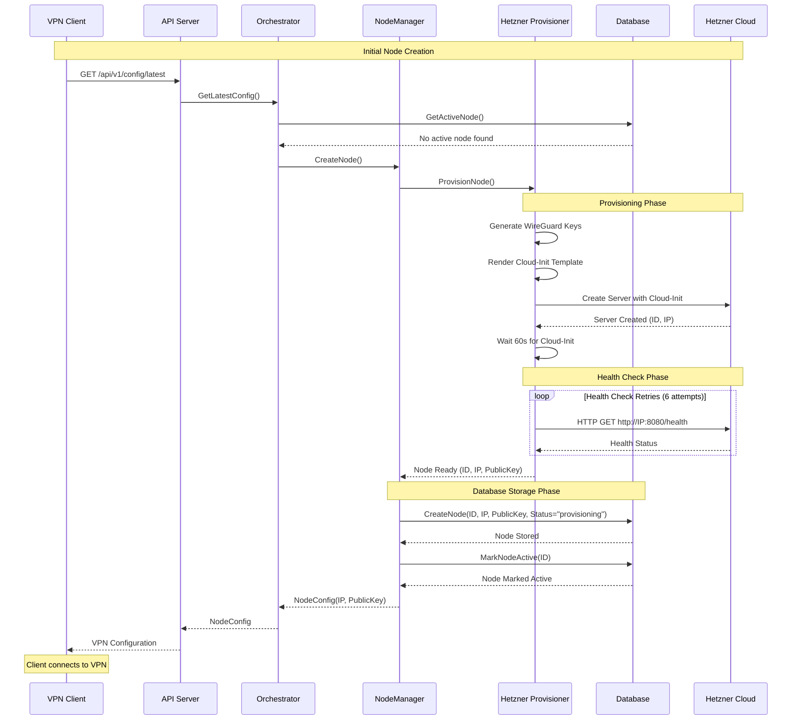
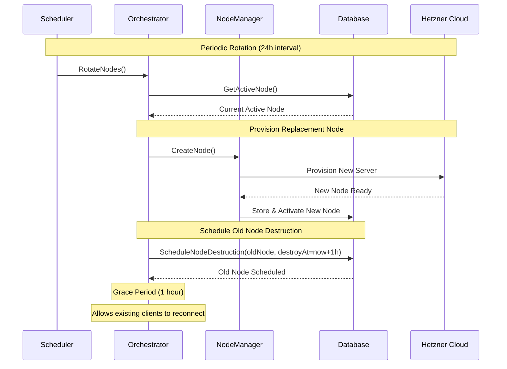
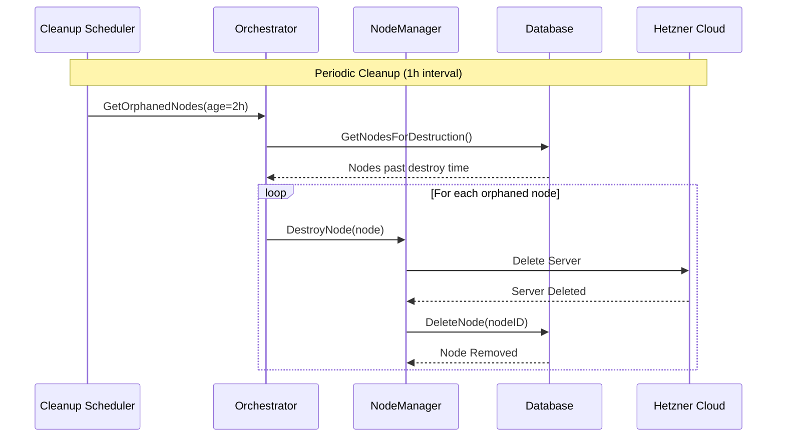
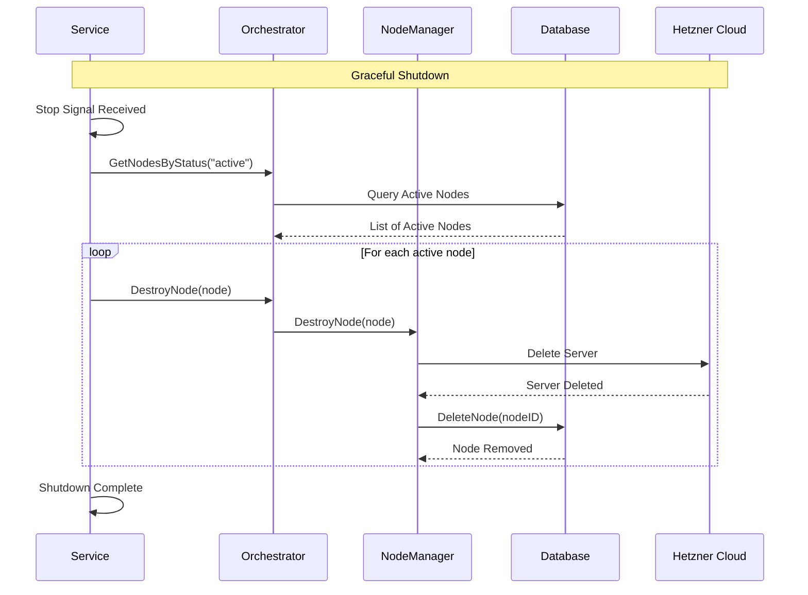
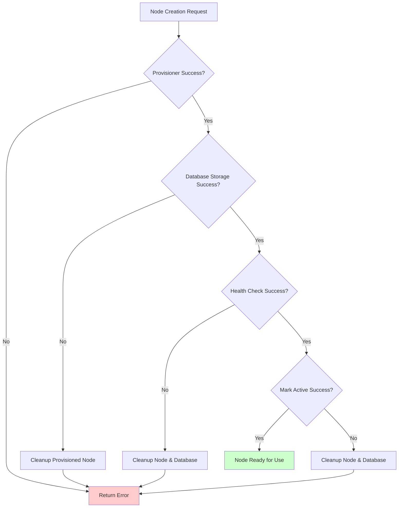

# VPN Node Lifecycle Documentation

This document explains how VPN nodes are deployed, used, and destroyed in the VPN Rotator service.

## Overview

The VPN Rotator service manages WireGuard VPN nodes on Hetzner Cloud infrastructure. It automatically provisions new nodes, rotates them periodically for security, and cleans up old nodes to maintain a single active VPN endpoint.

## Architecture Components

- **NodeManager**: Handles direct node operations (create, destroy, health checks)
- **Orchestrator**: Coordinates node lifecycle and rotation logic
- **Provisioner**: Interfaces with Hetzner Cloud API for server management
- **Scheduler**: Manages periodic rotation and cleanup tasks
- **Database**: Tracks node state and metadata

## Node Lifecycle States



## Complete Node Deployment Flow



## Node Rotation Process



## Node Cleanup Process



## Service Shutdown Cleanup



## Cloud-Init Configuration

When a new server is created, it's configured with a cloud-init script that:

1. **Installs WireGuard** and required packages
2. **Configures WireGuard interface** with generated keys
3. **Sets up firewall rules** (UFW) for VPN traffic
4. **Enables IP forwarding** for routing
5. **Starts health check server** on port 8080
6. **Configures systemd services** for auto-start

### Health Check Endpoint

Each node runs a Python health server that:
- Listens on port 8080
- Provides `/health` endpoint
- Checks if WireGuard interface is running
- Returns JSON status response

```json
{
  "status": "healthy",
  "timestamp": "2025-10-27T21:30:00.000Z",
  "service": "wireguard"
}
```

## Error Handling and Recovery



## Key Features

### 1. **Atomic Operations**
- Node creation is atomic - if any step fails, everything is cleaned up
- Database transactions ensure consistency
- No orphaned resources left behind

### 2. **Health Verification**
- Every node is health-checked before being marked active
- Health checks verify WireGuard is actually running
- Failed nodes are automatically cleaned up

### 3. **Graceful Rotation**
- New node is created before old node is destroyed
- Grace period allows existing clients to reconnect
- Zero-downtime rotation process

### 4. **Resource Cleanup**
- Automatic cleanup of expired nodes
- Service shutdown cleans up all active nodes
- No cloud resources left running after service stops

### 5. **Error Recovery**
- Failed provisioning attempts are cleaned up
- Unhealthy nodes are automatically destroyed
- Robust error handling at every step

## Configuration

Key configuration parameters:

- **Rotation Interval**: 24 hours (configurable)
- **Cleanup Interval**: 1 hour (configurable)
- **Grace Period**: 1 hour before node destruction
- **Health Check Timeout**: 10 seconds per attempt
- **Health Check Retries**: 6 attempts with 10s intervals
- **Cloud-Init Wait Time**: 60 seconds

## Monitoring and Observability

The service provides comprehensive logging for:
- Node provisioning events
- Health check results
- Rotation and cleanup operations
- Error conditions and recovery actions
- Database operations and state changes

All operations include structured logging with node IDs, IP addresses, and timestamps for easy debugging and monitoring.